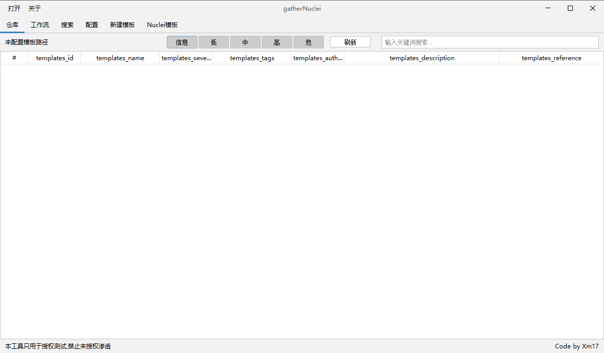
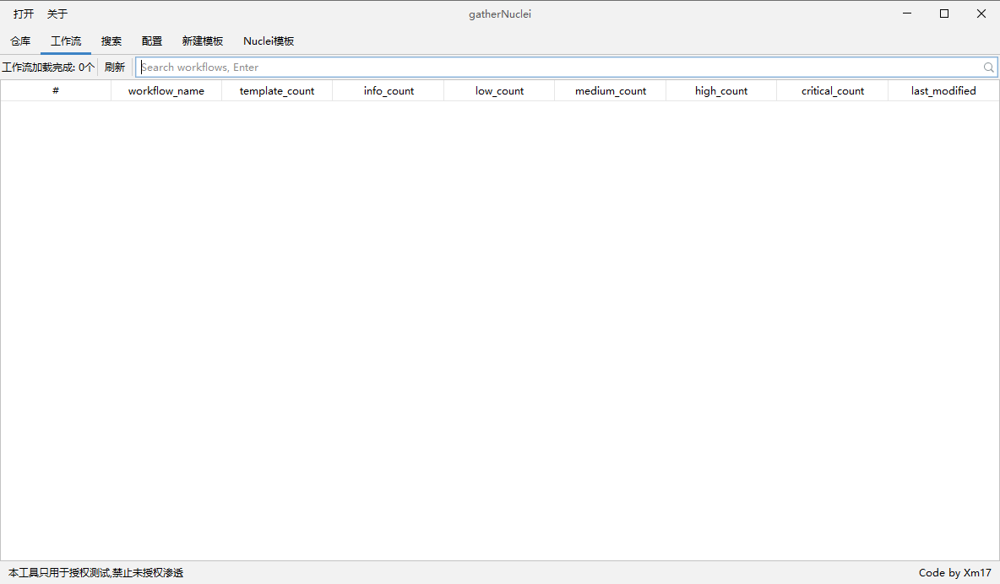
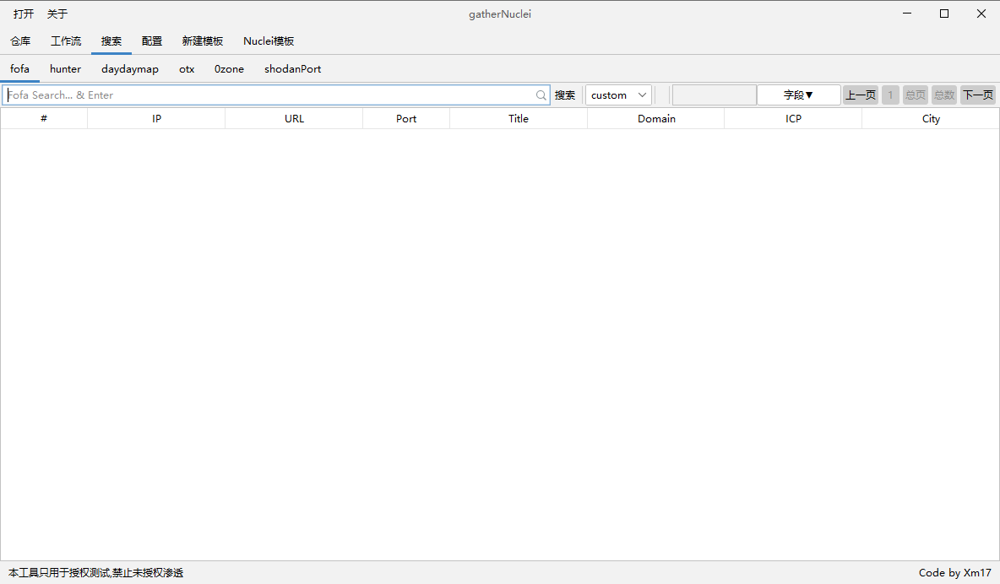
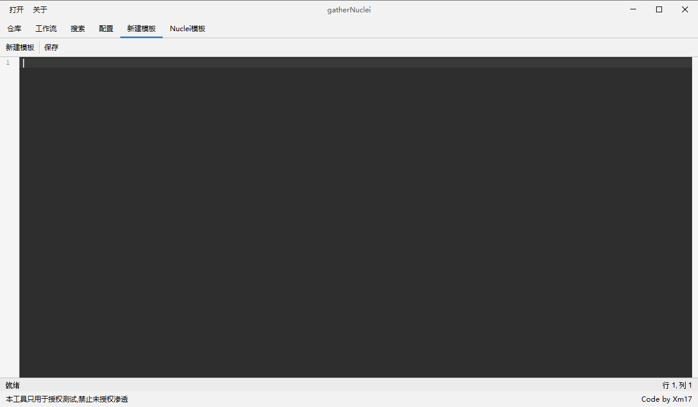
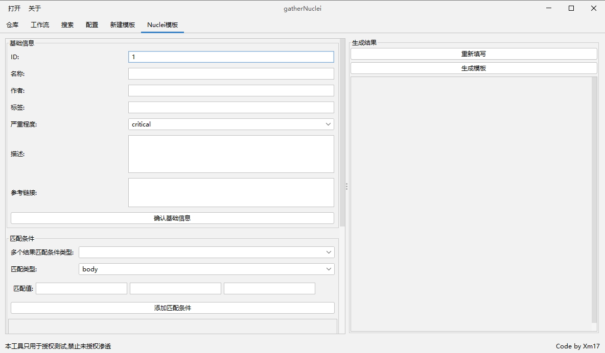
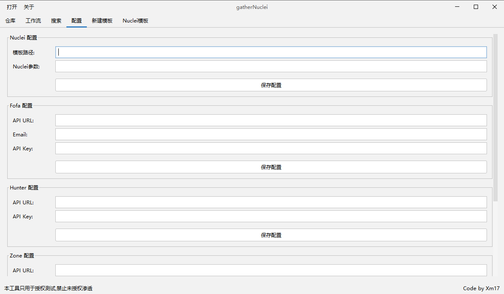

# JIU - Just Integrate Utils

一款集成了Nuclei模板管理、多空间引擎搜索的网络安全工具集。为安全研究人员提供高效的工作体验。

## 项目地址

https://github.com/kN6jq/gatherNuclei/

## ✨ 主要特性

- Nuclei模板管理与命令生成
- Nuclei工作流管理与命令生成
- Nuclei添加自定义模板
- Nuclei快速新增模板
- 多空间引擎集成搜索

## 📦 功能模块

### 1. Nuclei模板管理

快速加载和管理Nuclei模板，支持以下功能：
- 自动扫描并加载目录下所有模板
- 实时过滤和搜索（支持大小写敏感）
- 一键生成运行命令并复制到剪贴板

### 2. 模板工作流管理

可根据模板统一生成工作流,方便快速执行命令：

### 3. 空间引擎搜索

集成多个主流空间搜索引擎，提供统一的搜索接口：

### 4. 模板新建与快速新增

## 🚀 快速开始

1. 打开工具后，首先进入配置面板进行必要设置：
   

2. 各搜索引擎使用前需配置对应的API Key

3. 开始使用对应功能模块

## ⚠️ 免责声明

1. 本工具仅供安全研究和授权测试使用。使用本工具进行检测时，您应：
    - 获得足够的授权许可
    - 不得对未授权目标进行扫描

2. 使用者需对自己的行为负责，如因使用不当造成任何损失，本项目开发者不承担任何法律及连带责任。

## 🤝 贡献指南

- 欢迎通过Issue反馈问题或提出建议
- 欢迎提交Pull Request改进代码
- 欢迎Star支持项目发展

## 📃 开源协议

本项目遵循MIT协议开源。