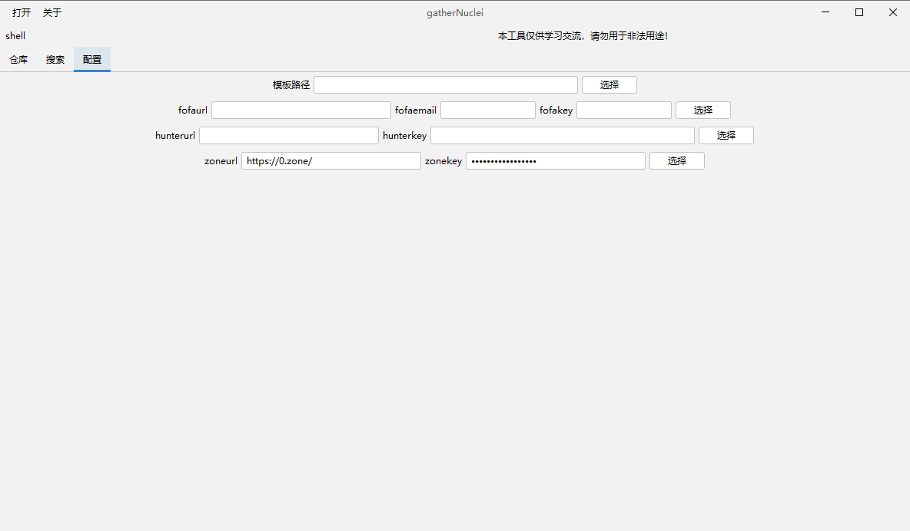
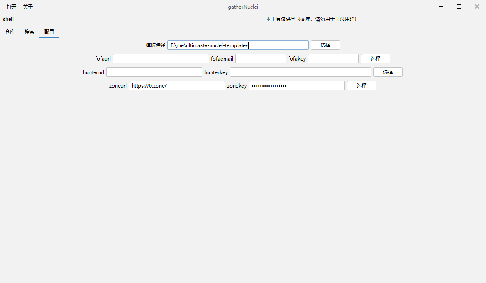
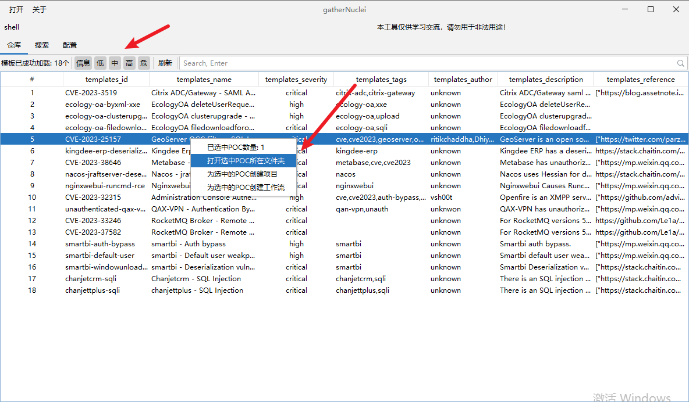
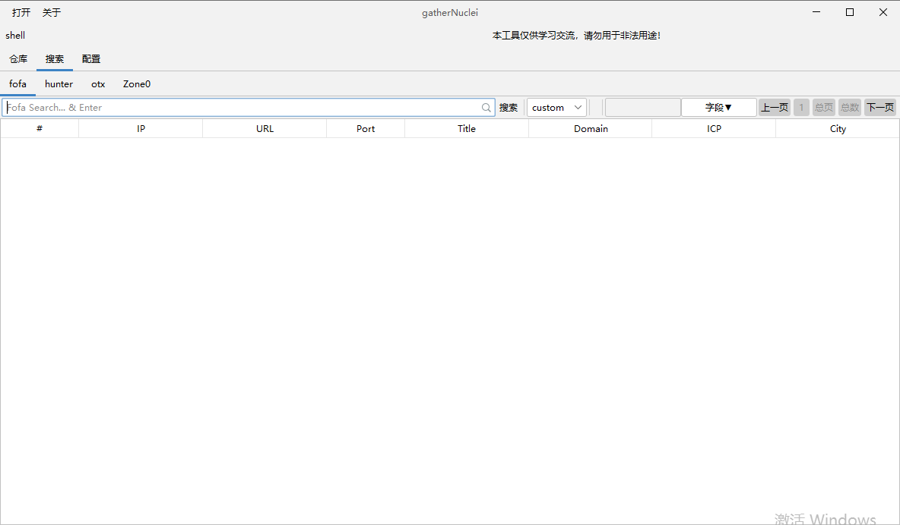
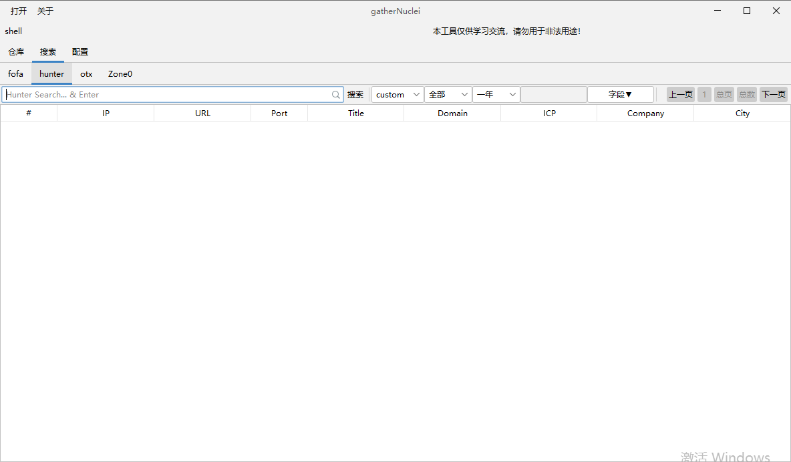
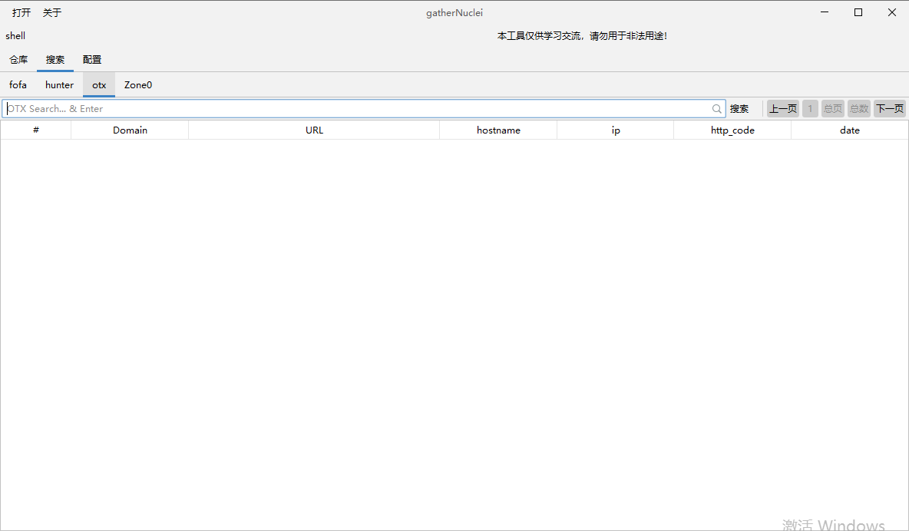
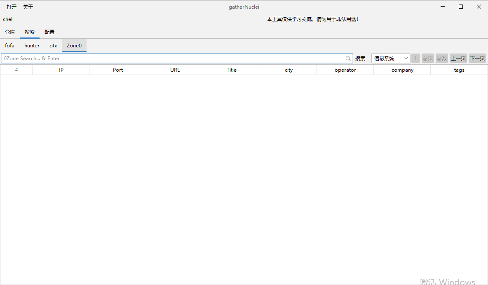

# 简介

一款及nuclei模板搜索利用及空间引擎站点信息收集的工具 (**由github copilot强力驱动**)

# 使用说明

各模块使用前应在config面板进行配置

# 功能

## nuclei模板快速生成运行命令

- 选择任意一个包含nuclei模板的目录,点击选择后,会自动加载该目录下的所有nuclei模板
- 使用默认进行filter过滤(包含大小写)
- 鼠标右键选择生成运行命令,会自动将命令复制到剪切板

## 空间引擎搜索

- 以下各类空间引擎使用均需要配置对应的api key,使用也很简单,输入关键词,点击搜索即可

### fofa

### hunter

### otx

### 0zone

# 参考

- 参考ui及部分表格操作 [nuclei-plus](https://github.com/Yong-An-Dang/nuclei-plus)

# todo

- 代码部分地方存在数组越界问题,不影响使用,待修复
- 如有更好的想法或者建议,欢迎提issue或者pr

# 注意事项

1. 在使用本工具进行检测时，您应确保该行为符合当地的法律法规，并且已经取得了足够的授权。请勿对非授权目标进行扫描。
2. 如您在使用本工具的过程中存在任何非法行为，您需自行承担相应后果，我们将不承担任何法律及连带责任。